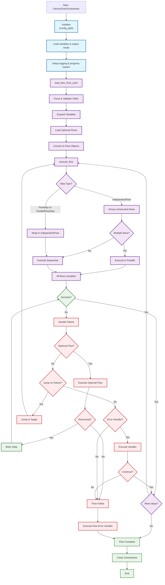

> SPDX-FileCopyrightText: Copyright (c) 2025 NVIDIA CORPORATION & AFFILIATES. All rights reserved.
>
> SPDX-License-Identifier: Apache-2.0

## Architecture

### Execution Architecture

The framework uses a **step-wrapping strategy** with a unified execution engine that processes all flow types through the same core execution path:

```
📄 YAML Flow Loading & Variable Expansion
    ↓
🔀 execute_flow() ← MAIN ENTRY POINT
    ├── FlowStep → Wrapped as IndependentFlow → Unified Engine
    ├── ParallelFlowStep → Wrapped as IndependentFlow → Unified Engine
    └── IndependentFlow → Direct to Unified Engine
                              ↓
                          execute_independent_flow()
                              ↓
                          _execute_flow_steps_unified() ← UNIFIED ENGINE
                              ↓
                          _execute_single_step_with_retries() ← Step Execution
                              ↓
                          _handle_step_failure_unified() ← Failure Handling
                              ├── Optional Flow Execution
                              ├── Jump Handling (success/failure)
                              ├── Error Handler Execution
                              └── Progress Tracking Integration
```

**Key Benefits:**
- ✅ **Unified execution path** - All step types processed through same engine
- ✅ **Feature consistency** - Optional flows, jumps, retries work identically
- ✅ **Comprehensive tracking** - StepExecution objects for all operations
- ✅ **Parallel optimization** - Consecutive IndependentFlows batched automatically

### Three-Tier Architecture

1. **Entry Layer**: YAML loading, variable expansion, flow object creation
2. **Orchestration Layer**: Unified execution engine with flow routing
3. **Device Layer**: Hardware-specific operations via factory flow classes

## Key Features

### 🔄 **Dynamic Flow Control**
- **Conditional Jumps**: `jump_on_success` and `jump_on_failure` with tag-based navigation
- **Scope Isolation**: Independent tag namespaces for main, optional, and parallel flows
- **Loop Prevention**: Sophisticated infinite loop detection and prevention

### ⚡ **Parallel Execution**
- **Concurrent Operations**: ThreadPoolExecutor-based parallel step execution
- **Thread-Safe Progress**: Real-time updates across multiple parallel flows
- **Resource Management**: Automatic cleanup and exception handling

### 🔧 **Error Recovery**
- **Optional Flows**: Automated recovery flows triggered on step failures
- **Custom Error Handlers**: User-defined error handling functions
- **Multi-Level Recovery**: Step-level and flow-level error handling

### 📊 **Comprehensive Progress Tracking**
- **Real-Time Updates**: Live progress bars and status displays
- **Detailed Metrics**: Step timing, retry counts, error messages
- **JSON Output**: Complete execution history for analysis and integration

### 🎨 **Flexible Output Modes**
- **None Mode**: Silent execution with file logging only
- **GUI Mode**: Rich library displays with progress bars
- **Log Mode**: Real-time log streaming to console
- **JSON Mode**: Structured progress output per stage

## Core Components

### 1. Factory Flow Orchestrator (`factory_flow_orchestrator.py`)

The central controller managing:
- **Unified Flow Execution**: Single engine for all step types
- **Parallel Operation Coordination**: Thread-safe concurrent execution
- **Progress Tracking**: Real-time updates and JSON persistence
- **Error Management**: Multi-level error handling and recovery
- **Device Flow Management**: Cached, reusable device connections

### 2. Progress Tracking (`flow_progress_tracker.py`)

Advanced tracking system featuring:
- **StepExecution Objects**: Comprehensive per-step metadata
- **FlowInfo Structures**: Flow-level statistics and summaries
- **Thread-Safe Operations**: Concurrent access protection
- **Automatic Metrics**: Performance and reliability calculations

### 3. Device Flow Functions

The framework includes device-specific flow functions for each supported device type:

- **Compute Operations**: BMC management, firmware updates, DOT security, power control
- **Switch Operations**: System configuration, SSH management, firmware validation

Detailed operation documentation is available in the docstrings of each device flow class in the `TrayFlowFunctions` directory.


# Nvfwupd Flow Framework - Architecture Flowchart

This document provides a comprehensive flowchart showing how the `factory_flow_orchestrator.py` currently works.

## Architecture Flowchart



## Flow Execution Overview

### 1. **Initialization**
- Load configuration from `factory_flow_config.yaml`
- Set output mode (GUI, log, JSON, or none)
- Initialize progress tracking and logging

### 2. **Load Flow from YAML**
- Parse and validate flow definition YAML file
- Expand variables (`${variable_name}`)
- Load optional flows (recovery procedures)
- Convert YAML to flow objects

### 3. **Execute Flow**
- Process each step in the flow definition
- Wrap individual steps into execution containers
- Execute multiple flows in parallel when possible
- Track progress and timing

### 4. **Step Execution**
- Execute operations on target devices (compute, switch)
- Retry on failure with configurable retry count
- Execute steps sequentially or in parallel as defined

### 5. **Failure Recovery**
- **Optional Flow**: Execute recovery procedure and retry
- **Jump on Failure**: Branch to different step sequence
- **Error Handler**: Custom error handling logic
- **Abort**: Terminate flow if no recovery available

### 6. **Completion**
- Execute flow-level error handler if flow failed
- Close all device connections
- Finalize progress tracking and logging

## Key Components

### **Input Configuration Files**
1. **factory_flow_config.yaml**: Main configuration
   - Device connection details (IP, credentials)
   - Variables for reuse across flows
   - Output mode settings
   - Default retry counts and timeouts

2. **Flow YAML Files**: Define execution sequences
   - Steps to execute on each device
   - Optional flows for recovery
   - Jump targets for branching logic
   - Error handlers

### **Flow Step Types**
- **FlowStep**: Single operation on a device
- **ParallelFlowStep**: Multiple operations running concurrently
- **IndependentFlow**: Self-contained flow that can run independently

### **Device Types**
- **Compute**: Server/node operations via BMC
- **Switch**: Network switch operations

### **Recovery Mechanisms**
1. **Retry**: Automatically retry failed operations (configurable count)
2. **Optional Flow**: Execute recovery procedure, then retry original step
3. **Jump on Failure**: Branch to alternate step sequence
4. **Error Handler**: Custom logic to handle or log failures

### **Execution Modes**
- **Sequential**: Steps execute one after another
- **Parallel**: Multiple flows or steps execute simultaneously
- Determined by how steps are structured in YAML 

## Configuration Files

Configuration files provide system-wide settings, device connections, and global variables. They are loaded once during `FactoryFlowOrchestrator` initialization and contain all the connection details and global variables needed for factory operations.

### Configuration File Structure

Configuration files are organized into several key sections:

#### Variables Section
Defines global variables available for expansion in all flow files:

```yaml
variables:
  # Output mode for orchestrator: "none", "gui", "log", or "json"
  output_mode: "gui"

  # Firmware bundle paths and names
  compute_bundles_folder: "<path_to_firmware_bundles>"
  bmc_firmware_bundle_name: "<bmc_firmware_bundle_name>.fwpkg"
  no_sbios_hmc_firmware_bundle_name: "<no_sbios_hmc_firmware_bundle_name>.fwpkg"
  cpu_sbios_bundle_name: "<cpu_sbios_bundle_name>.fwpkg"

  # Inband image names
  bluefield_3_inband_image_name: "<bluefield_3_inband_image_name>.bin"
  connect_x8_inband_image_name: "<connect_x8_inband_image_name>.bin"

  # Tool paths
  nvdebug_path: "<path_to_nvdebug>"
  mft_bundle_name: "mft-4.32.0-6017-linux-arm64-deb"

  # Switch firmware locations
  switch_bmc_bundle_uri: "scp://<username>:<password>@<ip>/<path>/<switch_bmc_package>"
  switch_cpld_file_uri: "scp://<username>:<password>@<ip>/<path>/<switch_cpld_file>"
  switch_bios_bundle_uri: "scp://<username>:<password>@<ip>/<path>/<switch_bios_package>"
  switch_nvos_bundle_uri: "scp://<username>:<password>@<ip>/<path>/<switch_nvos_file>"

  # DOT (Device of Trust) configuration
  pem_encoded_key: "<customer_defined_key>"
  ap_firmware_signature: "<customer_defined_signature>"

  # Expected firmware versions for validation
  # Versions used for version checking - If Not set, version check will be skipped
  bmc_final_version: "<bmc_firmware_inventory_version>"
  bmc_erot_final_version: "<bmc_erot_inventory_version>"
  bmc_backplane_cpld_final_version: "<bmc_backplane_cpld_inventory_version>"
  bmc_ipex_cpld_final_version: "<bmc_ipex_cpld_inventory_version>"

  hmc_final_version: "<hmc_firmware_inventory_version>"
  hmc_cpld_final_version: "<hmc_cpld_inventory_version>"
  hmc_fpga_final_version: "<hmc_fpga_inventory_version>"
  hmc_erot_final_version: "<hmc_erot_inventory_version>"
  hmc_cpu_erot_final_version: "<hmc_cpu_erot_inventory_version>"
  hmc_fpga_erot_final_version: "<hmc_fpga_erot_inventory_version>"
  cpu_final_version: "<cpu_firmware_inventory_version>"
  hmc_gpu_final_version: "<hmc_gpu_inventory_version>"

  # Switch Versions
  switch_bmc_final_version: "<nv_show_platform_firmware_version>"
  switch_fpga_final_version: "<nv_show_platform_firmware_version>"
  switch_erot_final_version: "<nv_show_platform_firmware_version>"
  switch_cpld1_final_version: "<nv_show_platform_firmware_version>"
  switch_bios_final_version: "<nv_show_platform_firmware_version>"

  switch_nvos_final_version: "<nv_show_system_version_version>"

```

#### Connection Section
Defines device connection details for all supported device types:

```yaml
connection:
  compute:
    bmc:
      ip: "192.168.1.100"
      username: "admin"
      password: "admin_password"
      port: 443
      protocol: "https"
    hmc:
      ip: "172.31.13.251"  # HMC tunnel IP
    os:
      ip: "192.168.1.100"
      username: "root"
      password: "root_password"
      port: 22
      protocol: "ssh"
  switch:
    bmc:
      ip: "192.168.1.101"
      username: "admin"
      password: "switch_password"
      port: 443
      protocol: "https"
    os:
      ip: "192.168.1.101"
      username: "admin"
      password: "switch_password"
      port: 22
      protocol: "ssh"
```

#### Device-Specific Configuration
Additional configuration sections for specific device types:

```yaml
compute:
  DOT: "Volatile"  # Options: "Volatile", "Locking", "NoDOT"

settings:
  default_retry_count: 2
  default_wait_after_seconds: 1
  execute_on_error: "default_error_handler"
  ssh_timeout: 30
  redfish_timeout: 60
```

### Variable Usage Rules

1. **Global Scope**: All variables defined in the config file are available to all flow files
2. **Reference Syntax**: Use `${variable_name}` in flow files to reference config variables
3. **Nested References**: Supports complex paths like `"${compute_bundles_folder}/${bmc_firmware_bundle_name}"`
4. **Required Variables**: Missing variables will cause flow loading to fail with detailed error messages
5. **Empty Values**: Variables can be empty strings (`""`) for optional configurations

## Flow Files

Flow files define the actual workflow sequences, recovery procedures, and step execution logic. They reference variables from configuration files and define the operations to be performed on factory devices.

### Flow File Structure

Flow files are organized into several main sections:

#### Settings Section (Optional)
Overrides global settings for this specific flow:

```yaml
settings:
  execute_on_error: "custom_error_handler"  # Override global error handler
```

#### Optional Flows Section
Defines recovery workflows that can be triggered by failed steps:

```yaml
optional_flows:
  bmc_recovery_flow:
    - name: "Reset BMC"
      device_type: compute
      device_id: compute1
      operation: reboot_bmc
      parameters:
        base_uri: "/redfish/v1/Managers/BMC_0/Actions/Manager.Reset"
        data: {"ResetType": "GracefulRestart"}
      wait_after_seconds: 60

    - name: "Verify BMC Ready"
      device_type: compute
      device_id: compute1
      operation: wait_ap_ready
      parameters:
        ap_name: ["FW_BMC_0"]
        timeout: 120
        base_uri: "/redfish/v1/UpdateService/FirmwareInventory"
```

#### Main Steps Section
Defines the primary workflow steps:

```yaml
steps:
  - name: "Check BMC Version"
    device_type: compute
    device_id: compute1
    operation: check_versions
    parameters:
      expected_versions:
        FW_BMC_0: "${bmc_final_version}"
      base_uri: "/redfish/v1/UpdateService/FirmwareInventory/"
      operator: "=="
    execute_optional_flow: "bmc_recovery_flow"
    jump_on_success: "bmc_version_ok"
    retry_count: 3

  - name: "Flash BMC Firmware"
    tag: "bmc_version_ok"
    device_type: compute
    device_id: compute1
    operation: pldm_fw_update
    parameters:
      bundle_path: "${compute_bundles_folder}/${bmc_firmware_bundle_name}"
      target_uris: ["/redfish/v1/UpdateService/FirmwareInventory/FW_BMC_0"]
      timeout: 1800
      force_update: true
```

### Flow Step Fields

Each flow step supports the following fields:

#### Required Fields
| Field | Type | Description |
|-------|------|-------------|
| `device_type` | enum | Device category: `compute` or `switch` |
| `device_id` | string | Logical device identifier (must match config connection keys) |
| `operation` | string | Method name to call on the device flow class |
| `parameters` | dict | Operation-specific parameters passed to the method |

#### Optional Control Fields
| Field | Type | Default | Description |
|-------|------|---------|-------------|
| `name` | string | `operation` | Human-readable step description |
| `tag` | string | None | Unique identifier for jump targets |
| `retry_count` | int | 3 | Number of retry attempts |
| `timeout_seconds` | int | None | Step execution timeout |
| `wait_after_seconds` | int | 0 | Delay after step completion |
| `wait_between_retries_seconds` | int | 0 | Delay between retry attempts |

#### Flow Control Fields
| Field | Type | Description |
|-------|------|-------------|
| `jump_on_success` | string | Tag to jump to when step succeeds |
| `jump_on_failure` | string | Tag to jump to when step fails |
| `execute_optional_flow` | string | Optional flow name to run on step failure |
| `execute_on_error` | string | Error handler function name |

### Step Types

Flow files support three types of step definitions:

#### 1. Single Steps
Basic individual operations:
```yaml
- name: "Power On System"
  device_type: compute
  device_id: compute1
  operation: power_on
  parameters:
    base_uri: "/redfish/v1/Systems/System_0/Actions/ComputerSystem.Reset"
    data: {"ResetType": "On"}
```

#### 2. Parallel Steps
Multiple operations executed concurrently:
```yaml
- name: "Parallel Updates"
  parallel:
    - name: "Update BMC"
      device_type: compute
      device_id: compute1
      operation: pldm_fw_update
      parameters:
        bundle_path: "${compute_bundles_folder}/${bmc_firmware_bundle_name}"
    - name: "Update Switch"
      device_type: switch
      device_id: switch1
      operation: update_system_image
      parameters:
        image_url: "${switch_bmc_bundle_uri}"
  max_workers: 2
```

#### 3. Independent Flows
Self-contained workflows that can run in parallel with other flows:
```yaml
- name: "Multi-Device Operations"
  independent_flows:
    - name: "Compute Flow"
      steps:
        - name: "Flash Compute Firmware"
          device_type: compute
          device_id: compute1
          operation: pldm_fw_update
          # ... parameters
    - name: "Switch Flow"
      steps:
        - name: "Flash Switch Firmware"
          device_type: switch
          device_id: switch1
          operation: update_system_image
          # ... parameters
```

### Variable Expansion in Flow Files

Flow files can reference any variable defined in the configuration file:

```yaml
steps:
  - name: "Flash Firmware"
    device_type: compute
    device_id: compute1
    operation: pldm_fw_update
    parameters:
      # Simple variable reference
      bundle_path: "${compute_bundles_folder}/${bmc_firmware_bundle_name}"
      # Nested path construction
      nvdebug_path: "${nvdebug_path}"
      # Version validation
      expected_version: "${bmc_final_version}"
```

## Error Handling

### Multi-Level Error Handling

1. **Step-Level Error Handlers**
   - Purpose: Recovery attempts during step execution
   - Return Value: `bool` (continue/abort flow)

2. **Optional Flows**
   - Purpose: Complex recovery scenarios
   - Scope: Isolated execution context

3. **Flow-Level Error Handlers**
   - Purpose: Final cleanup and logging
   - Execution: After complete flow failure
   - Return Value: `void` (flow outcome determined)

### Error Handler Execution Sequence

When a step fails, the framework follows this exact sequence:

1. **Initial Execution & Retries**
   - Step executed with configured `retry_count` attempts
   - Each retry attempt tracked and logged

2. **Optional Flow Recovery** (if `execute_optional_flow` defined)
   - Recovery flow executed for step-specific remediation
   - If optional flow succeeds: Step retried with fresh retry count
   - If optional flow fails: Flow fails immediately (no error handlers called)

3. **Jump on Failure** (if `jump_on_failure` defined)
   - Flow jumps to specified tag and continues execution
   - Allows workflow redirection without error handlers

4. **Step-Level Error Handler** (if `execute_on_error` defined on step)
   - Called with: `handler(step, error, context)` where `step` is real FlowStep object
   - **Can prevent flow failure**: If returns `True`, flow continues to next step
   - If returns `False`: Flow proceeds to failure handling

5. **Flow Failure & Tracking**
   - Flow marked as failed and progress tracking updated
   - Final error message collected from failed step

6. **Flow-Level Error Handler** (if global `execute_on_error` defined)
   - Called with: `handler(None, error, context)` where `step` is `None`
   - **Cannot prevent flow failure**: Result ignored, flow already failed
   - Used for final cleanup and log collection

**Key Points:**
- Step-level handlers can **recover and continue** the flow
- Flow-level handlers are for **final cleanup only**
- If both are defined: Step handler runs first, flow handler runs only if step handler returns `False`
- Optional flows take precedence over error handlers for recovery

### Custom Error Handler Registration

```python
def custom_recovery(step, error, context):
    """Custom error handler for device recovery."""
    print(f"Handling error in {step.name}: {error}")
    # Implement recovery logic
    return True  # Continue flow

orchestrator.register_error_handler("custom_recovery", custom_recovery)
```

### Built-in Error Handlers

The framework includes several built-in error handlers:

#### error_handler_collect_nvdebug_logs
Collects comprehensive debug logs from devices when failures occur. Automatically triggered at flow level if set in global settings.

```yaml
settings:
  execute_on_error: "error_handler_collect_nvdebug_logs"
```

#### error_handler_boot_failure_gb300
Comprehensively analyzes POST logs when boot operations fail on GB300 systems. This handler checks for multiple failure conditions including common boot misconfigurations and SOCAMM (System On Chip Attached Memory Module) memory errors. It is specifically designed for GB300 compute trays and includes advanced timestamp matching to ensure logs from the same boot attempt are analyzed together.

**Key Features:**
- Automatically detects 1-socket or 2-socket configurations
- Matches POST logs by timestamp to ensure correct log pairs are analyzed
- Supports both IPMI SOL and SSH SOL logging methods
- **Checks for common boot errors:**
  - UEFI Interactive Shell (system booted to shell instead of OS)
  - PXE boot (network boot instead of local boot)
  - UEFI Setup (stuck in BIOS setup menu)
  - SDRAM training failures (with bitmask details)
  - Cross-socket channel mismatches (dual-socket configuration issues)
- Runs the `socamm_mapping.py` script to identify failing memory channels
- Reports physical J-connector locations for failed memory modules
- **Provides clear diagnosis:** distinguishes between SOCAMM errors and other boot issues

**Configuration:**

POST logging is configured globally in the factory flow config file:

```yaml
# In GB300_factory_flow_config.yaml
compute:
  # Enable POST logging during boot operations (default: false)
  post_logging_enabled: true
  # POST logging method: true for SSH SOL (ports 2200/2203), false for IPMI SOL (default: false)
  # SSH SOL is recommended as it provides timestamp-matched dual-socket logs
  use_ssh_sol: true
```

**Flow Usage:**

Attach the error handler to `wait_for_boot` steps:

```yaml
steps:
  - name: wait_for_boot_to_uefi
    device_type: compute
    device_id: compute1
    operation: wait_for_boot
    execute_on_error: "error_handler_boot_failure_gb300"
    parameters:
      power_on_uri: /redfish/v1/Systems/System_0/Actions/ComputerSystem.Reset
      power_on_data: {"ResetType": "On"}
      system_uri: /redfish/v1/Systems/System_0
      state: ["OSRunning", "OSBootStarted"]
      timeout: 600
```

**Log File Naming:**

When `use_ssh_sol: true` (recommended):
- Socket 0: `post_log_YYYYMMDD_HHMMSS.txt`
- Socket 1: `post_log_2_YYYYMMDD_HHMMSS.txt`
- Both files share the same timestamp, ensuring they're from the same boot

When `use_ssh_sol: false` (IPMI mode):
- Single log: `post_log_YYYYMMDD_HHMMSS.txt` (socket 0 only)

**How It Works:**

1. When a `wait_for_boot` step fails, this error handler is triggered
2. The handler searches the log directory for POST log files
3. If timestamped logs are found, it matches socket 0 and socket 1 by timestamp
4. The most recent matching set is selected for analysis
5. **Common boot error checks** are performed (UEFI shell, PXE boot, UEFI setup, etc.)
6. **SOCAMM memory analysis** runs the `socamm_mapping.py` script with product "gb300"
7. A clear summary is provided distinguishing between different error types

**Example Output (No Errors Found):**
```
[ERROR] Step wait_for_boot_to_uefi failed: Boot timeout after 600 seconds
[INFO] Analyzing POST logs for boot failure
[INFO] Found 2 POST log(s) to analyze
[INFO] Checking for common boot error conditions...
[INFO] Running SOCAMM memory analysis...
[INFO] SOCAMM Analysis Results for socket_0:
[INFO]   Checking SOCAMM mapping for gb300
[INFO]   No matching log entry found for socket_0.
[INFO] SOCAMM Analysis Results for socket_1:
[INFO]   Checking SOCAMM mapping for gb300
[INFO]   No matching log entry found for socket_1.
[INFO] ================================================================================
[INFO] BOOT FAILURE ANALYSIS SUMMARY:
[INFO] --------------------------------------------------------------------------------
[INFO] SOCAMM: No memory training errors detected
[INFO] No known error patterns detected in POST logs
[INFO] Boot failure may be due to other causes (timeout, unexpected reset, etc.)
[INFO] ================================================================================
```

**Example Output (With Errors):**
```
[ERROR] Step wait_for_boot_to_uefi failed: Boot timeout
[INFO] Analyzing POST logs for boot failure
[INFO] Found 2 POST log(s) to analyze
[INFO] Checking for common boot error conditions...
[ERROR] [socket_0] System booted to PXE boot
[INFO] Running SOCAMM memory analysis...
[INFO] SOCAMM Analysis Results for socket_0:
[INFO]   Checking SOCAMM mapping for gb300
[INFO]   Extracted bit mask: 0x00000024 for socket_0
[INFO]   Channels failed: [2, 5]
[INFO]   J numbers affected: ['J3', 'J6']
[INFO] ================================================================================
[INFO] BOOT FAILURE ANALYSIS SUMMARY:
[INFO] --------------------------------------------------------------------------------
[ERROR] COMMON BOOT ERRORS DETECTED - Review error messages above
[ERROR] SOCAMM MEMORY ERRORS DETECTED - Review analysis above for affected J-connectors
[INFO] ================================================================================
```

**Troubleshooting:**

If no POST logs are found:
- Verify `post_logging_enabled: true` is set in the config
- Check that `wait_for_boot` is being called (POST logging starts automatically)
- Verify BMC credentials are correct for SSH/IPMI access

If timestamp mismatch occurs:
- This typically happens when analyzing logs from different boot attempts
- The handler automatically selects the most recent matching pair
- Check log directory timestamps to verify correct logs are being analyzed

