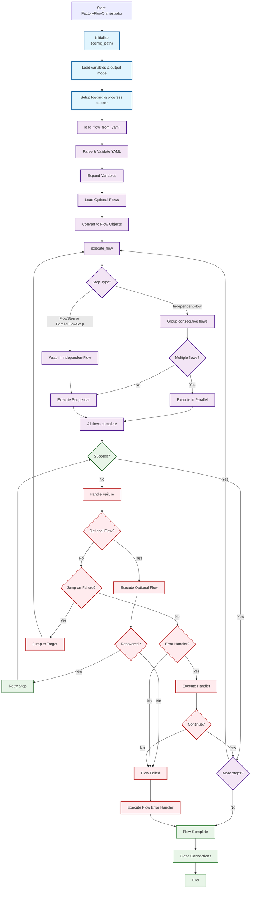

> SPDX-FileCopyrightText: Copyright (c) 2025 NVIDIA CORPORATION & AFFILIATES. All rights reserved.
>
> SPDX-License-Identifier: Apache-2.0

# Nvfwupd Flow Framework - Architecture Flowchart

This document provides a comprehensive flowchart showing how the `factory_flow_orchestrator.py` currently works.

## Architecture Flowchart

## Flow Execution Overview

### 1. **Initialization**
- Load configuration from `factory_flow_config.yaml`
- Set output mode (GUI, log, JSON, or none)
- Initialize progress tracking and logging

### 2. **Load Flow from YAML**
- Parse and validate flow definition YAML file
- Expand variables (`${variable_name}`)
- Load optional flows (recovery procedures)
- Convert YAML to flow objects

### 3. **Execute Flow**
- Process each step in the flow definition
- Wrap individual steps into execution containers
- Execute multiple flows in parallel when possible
- Track progress and timing

### 4. **Step Execution**
- Execute operations on target devices (compute, switch, power shelf)
- Retry on failure with configurable retry count
- Execute steps sequentially or in parallel as defined

### 5. **Failure Recovery**
- **Optional Flow**: Execute recovery procedure and retry
- **Jump on Failure**: Branch to different step sequence
- **Error Handler**: Custom error handling logic
- **Abort**: Terminate flow if no recovery available

### 6. **Completion**
- Execute flow-level error handler if flow failed
- Close all device connections
- Finalize progress tracking and logging

## Key Components

### **Input Configuration Files**
1. **factory_flow_config.yaml**: Main configuration
   - Device connection details (IP, credentials)
   - Variables for reuse across flows
   - Output mode settings
   - Default retry counts and timeouts

2. **Flow YAML Files**: Define execution sequences
   - Steps to execute on each device
   - Optional flows for recovery
   - Jump targets for branching logic
   - Error handlers

### **Flow Step Types**
- **FlowStep**: Single operation on a device
- **ParallelFlowStep**: Multiple operations running concurrently
- **IndependentFlow**: Self-contained flow that can run independently

### **Device Types**
- **Compute**: Server/node operations via BMC
- **Switch**: Network switch operations
- **Power Shelf**: Power supply unit management

### **Recovery Mechanisms**
1. **Retry**: Automatically retry failed operations (configurable count)
2. **Optional Flow**: Execute recovery procedure, then retry original step
3. **Jump on Failure**: Branch to alternate step sequence
4. **Error Handler**: Custom logic to handle or log failures

### **Execution Modes**
- **Sequential**: Steps execute one after another
- **Parallel**: Multiple flows or steps execute simultaneously
- Determined by how steps are structured in YAML 